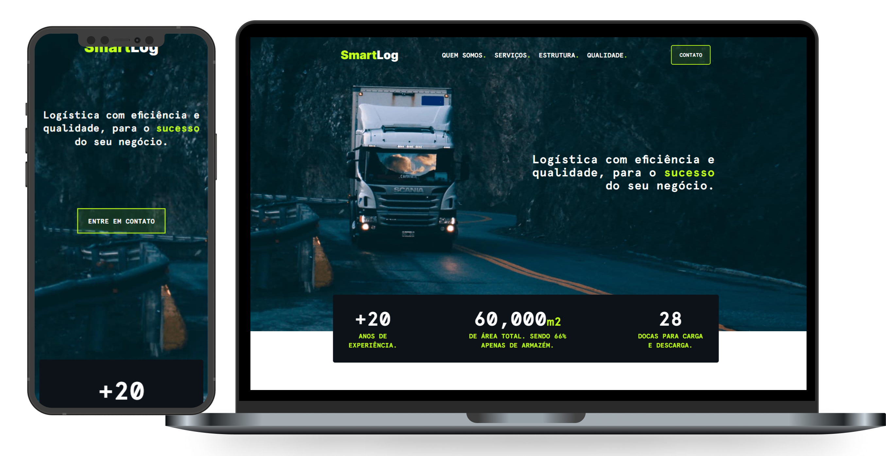

<h1 align="center">SmartLog</h1>  
<p align="center">A landing page for a logistics warehouse.</p>
<a href="https://ekaizen.luizfranzon.dev">
  <p align="center"></p>
</a>



## 💻Run Locally

Clone the project and go to the project directory.

```bash
  git clone https://github.com/luizfranzon/eKaizen-frontend.git && cd eKaizen-frontend
```

Install dependencies

```bash
  npm install
```

Start the developer server

```bash
  npm run dev
```


## 🤝 Contributing

Contributions are always welcome!
Just create a fork of this repo, and start coding.

## 💬 Feedback

If you have any feedback, please reach out at <a href="mailto:contato@luizfranzon.dev">contato@luizfranzon.dev</a>.
